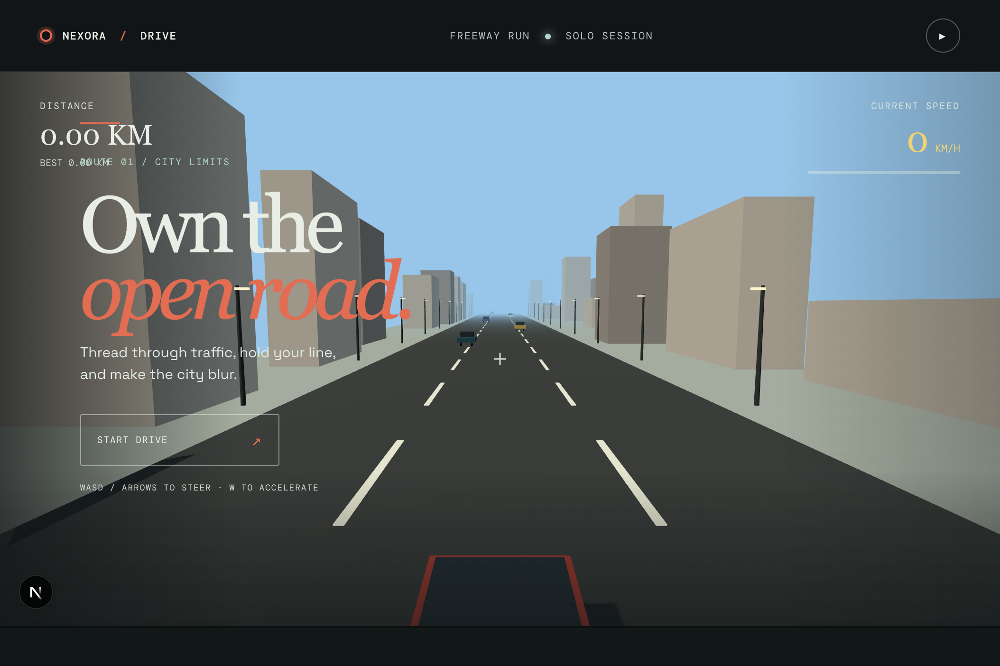

# ZENVOX: DRIVE



ZENVOX: DRIVE is a focused browser-based 3D driving game built with Next.js, Three.js, and GSAP. Drive a red sports car through a procedural city freeway, accelerate past traffic, steer between lanes, and build your distance without crashing.

See [GAME_DETAILS.md](GAME_DETAILS.md) for the complete game design and technical specification.

## How To Play

1. Start the drive from the opening screen.
2. Use `A`/`D` or the left/right arrow keys to steer.
3. Hold `W` or the up arrow to accelerate.
4. Use `S` or the down arrow to slow down.
5. Avoid traffic cars. A collision ends the run.
6. Drive through golden checkpoint rings to earn `+100` bonus points.
7. Use the pause button in the top-right corner to pause or resume.

On small screens, use the on-screen left, up, and right controls.

## Game Structure

- `app/page.tsx` opens the single game directly.
- `src/games/drive/DriveGame.tsx` contains the road, city, cars, controls, speed, distance, traffic movement, collision detection, and crash state.
- `app/globals.css` contains the responsive game layout, HUD, overlays, buttons, and mobile controls.
- `app/layout.tsx` defines the page metadata and Google fonts.
- `public/game-screenshot.png` is a screenshot of the playable opening screen.

## Technology

- **Next.js 16** and **React 19** for the app shell and UI state.
- **React Three Fiber**, **Drei**, **Rapier**, **Zustand**, **TanStack Query**, and **Zod** are installed as the foundation for future game systems.
- **Three.js** for the 3D road, city blocks, lamps, traffic, car models, lighting, and camera.
- **GSAP** for the car launch and crash motion.
- **TypeScript** for typed game state and component logic.

## Run Locally

From this directory:

```bash
npm install
npm run dev
```

Open [http://localhost:3000](http://localhost:3000) in your browser. The homepage goes straight to the game.

## Production Build

```bash
npm run lint
npm run build
npm start
```

## Notes

The game is intentionally self-contained: it uses procedural Three.js geometry and does not require external image or model assets. The freeway is responsive and caps the renderer pixel ratio to keep the experience smooth on high-density screens.
